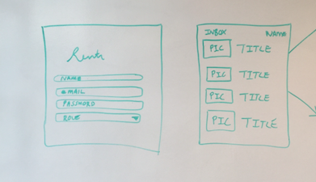

Rentr

Technologies used: Ruby on Rails4, Bootstrap, HTML, CSS, Heroku, GitHub

Approach taken: By creating two models that connect to one another using Ruby on Rails 4 methods, I created an application that has (limited) user capabilities (model 1), and listing capabilities(model 2). Using the Heroku system allowed the application to be pushed and deployed online with its own unique url instead of solely being a local server-based application.

Installation instructions: The application can be reached via https://sheltered-shelf-94728.herokuapp.com where a user can create a login to view listings, and create and edit listings if needed.

Unsolved problems:
- creating a more unique profile system so that the user’s information is stored and available for view
- a message system (third model perhaps) that will allow for messaging between users within the application.
- connecting a comment box to the listings so that the messaging system mentioned above can be initiated within the listing index.
-creating separate views for two different types of users (owners and applicants)
- getting more practice with Bootstrap and Ruby on Rails 4
- how to get income sorting aspect of app completed.

Wireframe:

User stories:
- User will be able to log in and view listings and reply to them.
- User will be able to post listings and edit accordingly.
- User will be able to create a profile and message listings they choose.
